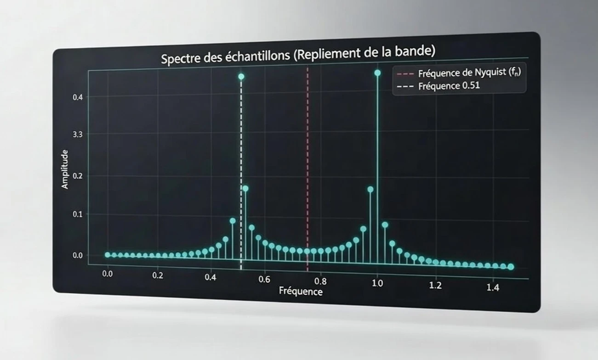

<h1 align="center">Traitement du Signal Numérique</h1>
<h2 align="center">Échantillonnage et Filtrage</h2> 

<p align="center">
  
  
  
</p>

<p align="center">
  
</p>

Ce projet a été réalisé dans le cadre d’un module universitaire visant à explorer les concepts fondamentaux du **traitement du signal numérique**. Il met en avant les principes de l’échantillonnage et des filtres à Réponse Impulsionnelle Finie (RIF).

L’objectif est de comprendre l’impact des paramètres sur la qualité du signal et d’évaluer différentes techniques de filtrage numérique.

---

## Points clés

* **Échantillonnage** : implémentation de la discrétisation d'un signal continu et analyse du théorème de Shannon–Nyquist.
* **Transformée de Fourier** : étude du spectre des signaux échantillonnés et identification de l'aliasing (repliement spectral).
* **Filtres RIF** :
  * Comparaison de plusieurs types : moyenneur, passe-bas gaussien, sinc et dérivateur.
  * Analyse de la réponse fréquentielle et de la performance des filtres.
* **Filtres à phase linéaire** :
  * Conception de filtres passe-bas, passe-haut, passe-bande et coupe-bande.
  * Comparaison des fenêtres d'apodisation : Hann et rectangulaire.


## Ressources 

Le projet est centralisé dans un Notebook Jupyter, disponible sous deux formats :

| Format | Emplacement |
| :--- | :--- |
| Notebook Interactif | [`notebook/echantillonnage-et-filtrage.ipynb`](./notebook/echantillonnage-et-filtrage.ipynb) |
| Rapport Statique (PDF) | [`export/echantillonnage-et-filtrage.pdf`](./export/echantillonnage-et-filtrage.pdf) |
|  |  |

> **Note** : La version PDF est issue d’un export direct du Notebook.


## Installation et utilisation

Pour explorer le projet en local :

```bash
# Cloner le dépôt
git clone https://github.com/rmdair/Digital-Signal-Analysis.git

# Accéder au dossier du projet
cd Digital-Signal-Analysis
```
